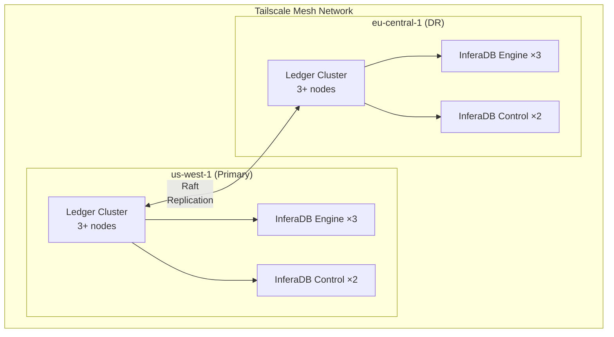
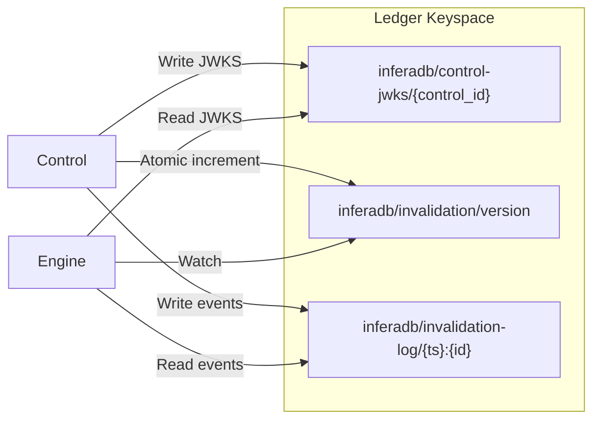
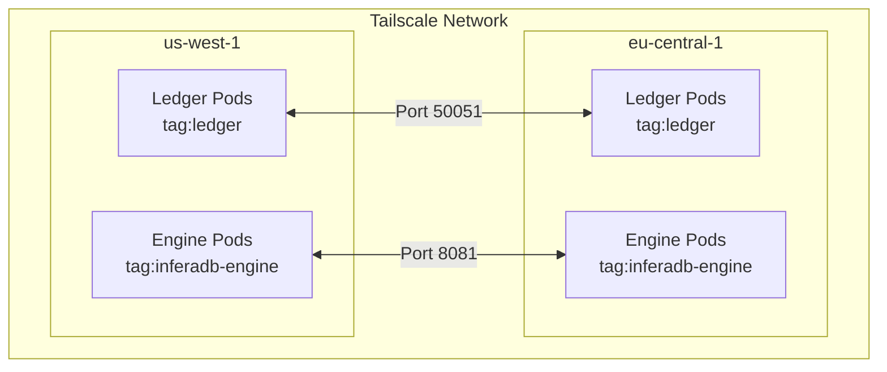
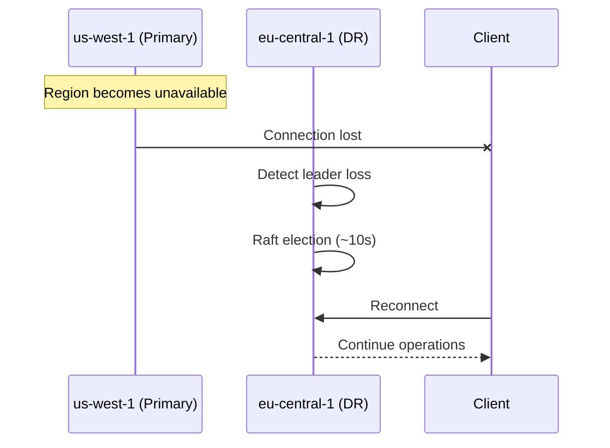
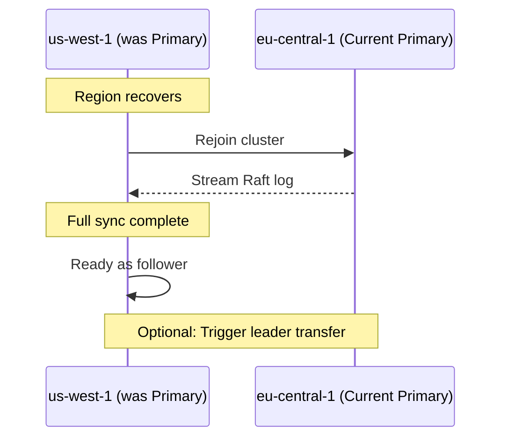

# Ledger Multi-Region Deployment Guide

This guide covers deploying InferaDB with Ledger's Raft replication for multi-region high availability.

## Overview

InferaDB uses Ledger's native Raft replication for data synchronization across regions. This provides:

- **Sub-second failover**: Automatic leader election when primary fails
- **Strong consistency**: ACID transactions with cryptographic verification
- **Low operational overhead**: Single storage system to manage
- **Cross-service communication**: Control and Engine share data via Ledger

## Architecture



## Ledger Shared Keyspace

Control and Engine communicate through Ledger, eliminating HTTP dependencies between services:



This architecture enables:

- **JWKS Discovery**: Engine reads Control's public keys from Ledger instead of HTTP
- **Cache Invalidation**: Engine watches for invalidation events via Ledger watch API
- **Multi-region**: Raft replication synchronizes all shared data automatically

## Prerequisites

1. **Kubernetes clusters** in each target region
2. **Tailscale** for cross-region networking (or alternative VPN)
3. **Storage class** capable of provisioning persistent volumes

## Deployment Methods

### Option 1: Terraform (Recommended)

Use the provided Terraform modules for automated deployment:

```bash
cd terraform/examples/aws-multi-region
cp terraform.tfvars.example terraform.tfvars
# Edit terraform.tfvars with your configuration
terraform init
terraform apply
```

See [terraform/examples/aws-multi-region/README.md](../../terraform/examples/aws-multi-region/README.md) for details.

> **Note on Terraform Locations:**
>
> - `terraform/` (repo root) - Example configurations and reusable modules for quick-start deployments
> - `deploy/terraform/` - Production infrastructure with environment-specific configs, GitOps integration, and multi-provider support
>
> For production deployments, see [deploy/README.md](../../deploy/README.md).

### Option 2: Kubernetes Manifests

For manual deployment using kubectl:

```bash
# 1. Create namespace
kubectl create namespace inferadb

# 2. Deploy Tailscale secret
kubectl create secret generic tailscale-auth \
  --from-literal=authkey=$TAILSCALE_AUTH_KEY \
  -n inferadb

# 3. Deploy Ledger cluster (primary first, then secondary)
kubectl apply -f ledger/k8s/ledger-cluster-primary.yaml
kubectl apply -f ledger/k8s/ledger-cluster-secondary.yaml
```

## Configuration

### Redundancy Modes

| Mode     | Replicas | Fault Tolerance    | Use Case                 |
| -------- | -------- | ------------------ | ------------------------ |
| `single` | 1        | None               | Development only         |
| `double` | 3        | 1 node failure     | Production (recommended) |
| `triple` | 5        | 2 node failures    | High security            |

### Multi-Region Configuration

Configure Raft replication topology:

```yaml
config:
  raft:
    clusterSize: 3
    regions:
      - id: us-west-1
        priority: 1 # Lower = higher priority (primary)
      - id: eu-central-1
        priority: 2 # DR region
```

**Key parameters:**

| Parameter     | Description                         | Recommended              |
| ------------- | ----------------------------------- | ------------------------ |
| `clusterSize` | Nodes per region                    | 3 or 5                   |
| `priority`    | Failover priority (lower = primary) | 1 for primary, 2+ for DR |

### Replica Counts

Scale replicas based on your workload:

| Workload | Replicas per Region | Notes           |
| -------- | ------------------- | --------------- |
| Small    | 3                   | Minimum for HA  |
| Medium   | 5                   | Better throughput |
| Large    | 7+                  | High throughput |

## Cross-Region Networking

### Tailscale Setup



1. **Create auth key** at <https://login.tailscale.com/admin/settings/keys>
   - Make it reusable
   - Add tags: `tag:ledger`, `tag:inferadb-engine`

2. **Configure ACLs**:

   ```json
   {
     "acls": [
       {
         "action": "accept",
         "src": ["tag:ledger"],
         "dst": ["tag:ledger:50051"]
       },
       {
         "action": "accept",
         "src": ["tag:inferadb-engine"],
         "dst": ["tag:ledger:50051"]
       }
     ],
     "tagOwners": {
       "tag:ledger": ["autogroup:admin"],
       "tag:inferadb-engine": ["autogroup:admin"]
     }
   }
   ```

3. **Deploy sidecar** - The Tailscale sidecar is included in the Ledger cluster manifests:

   ```yaml
   containers:
     - name: tailscale
       image: tailscale/tailscale:latest
       env:
         - name: TS_AUTHKEY
           valueFrom:
             secretKeyRef:
               name: tailscale-auth
               key: authkey
         - name: TS_USERSPACE
           value: "true"
   ```

### Alternative: VPC Peering

If not using Tailscale, configure VPC peering between regions:

1. Create VPC peering connection
2. Update route tables in both VPCs
3. Configure security groups to allow Ledger port (50051)

## Monitoring

### Health Checks

```bash
# Check Ledger cluster health
kubectl exec -it inferadb-ledger-0 -n inferadb -- grpcurl -plaintext localhost:50051 grpc.health.v1.Health/Check

# Check cluster status
kubectl exec -it inferadb-ledger-0 -n inferadb -- grpcurl -plaintext localhost:50051 inferadb.ledger.v1.Admin/GetClusterStatus
```

### Key Metrics

| Metric                          | Description            | Alert Threshold |
| ------------------------------- | ---------------------- | --------------- |
| `ledger_raft_leader`            | Current leader node    | == 0 (no leader) |
| `ledger_replication_lag_seconds`| Replication delay      | > 5s            |
| `ledger_raft_peers_connected`   | Connected peers        | < quorum        |
| `ledger_storage_used_bytes`     | Storage utilization    | > 80%           |

### Prometheus Queries

```promql
# Raft leader status
ledger_raft_leader

# Replication lag
ledger_replication_lag_seconds

# Storage utilization
ledger_storage_used_bytes / ledger_storage_total_bytes * 100
```

## Failover Procedures

### Automatic Failover



Ledger Raft replication handles most failures automatically:

1. Primary region becomes unavailable
2. Remaining nodes detect leader loss
3. Raft election promotes new leader (typically < 10 seconds)
4. Applications continue with minimal disruption

### Failback



After the original primary recovers:

1. It automatically rejoins the cluster as a follower
2. Raft log is replicated to bring it up to date
3. Optionally trigger leader transfer to restore original topology

## Troubleshooting

### Cluster Not Forming

**Symptoms:** Ledger pods running but cluster unavailable

**Checks:**

1. Pod logs: `kubectl logs -n inferadb statefulset/inferadb-ledger`
2. Peer connectivity: Check Tailscale status
3. Network connectivity between pods

### Replication Not Working

**Symptoms:** High replication lag or no DR synchronization

**Checks:**

1. Tailscale connectivity: `kubectl exec -it inferadb-ledger-0 -n inferadb -c tailscale -- tailscale status`
2. Multi-region config matches in both clusters
3. Raft status: `grpcurl -plaintext localhost:50051 inferadb.ledger.v1.Admin/GetClusterStatus`

### High Latency

**Symptoms:** Slow authorization decisions

**Checks:**

1. Local vs. remote reads: Ensure Engine connects to local Ledger
2. Network latency between regions
3. Disk I/O performance

## Best Practices

1. **Use dedicated Ledger nodes** with NVMe storage for best performance
2. **Monitor replication lag** and alert on > 5 seconds
3. **Test failover regularly** in staging environments
4. **Use consistent configuration** across all regions
5. **Enable TLS** for production deployments
6. **Document runbooks** for your operations team

## References

- [Tailscale Kubernetes](https://tailscale.com/kb/1185/kubernetes)

## Related Tools

- **[Terraform Provider for InferaDB](../../terraform-provider-inferadb/README.md)**: Manage Control Plane resources (organizations, vaults, clients, grants) via Terraform. Use this for provisioning application-level resources after infrastructure deployment.
